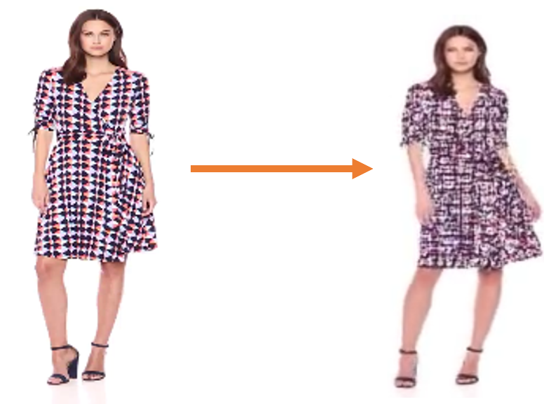
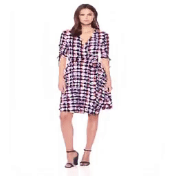
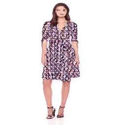

When I decided to do research on human related generative models, 
at first I tried to understand how others have accomplished 
generating synthesized images or videos.

That is why I surveyed and arranged human synthesis papers [here](assets/Human_body_synthesis_survey.md)

When I look through those papers and run train and inference code from opened repository,
I decided to try solving the generation process in unsupervised ways.

It was because a) The quality of output video was lower than result from supervised methods and
b) A lot of models does not consider relationship between frames, so I thought it worth doing.
Especially for dynamic patterns of clothes, almost models is not able to reproduce the original pattern
when generating videos.

After picking the topic and studied some previous works, I decided to set First Order Motion Model
as baseline so I digged into the [papers](assets/First_Order_Motion_Model_Research.pdf)

When I tried FOMM for train and inference, the quality was not that good as below.

First strategy I thought was to consider the relationship between frames like other 
[video generation models](assets/Video_generation.md)

I adapted 3D networks for driving loss from generated and real images not comparing image to image but
comparing videos to videos. I used to train 3 frames for 5 frames with sequentially extracted or
randomly extracted as a set of videos but it does not seem as good result

 

Then I tried to find out research with similar tasks. I focussed on synthesizing dynamic textures like here
(From https://github.com/ryersonvisionlab/two-stream-dyntex-synth)

So I surveyed research with such problems like [these](assets/dynamic_survey.md) and tried to adapt such ideas with
my baseline model (like Gram–Schmidt matrix for style transfer, optical flow for intra-frames relation) but
result was not get better.

Next I tried to find out research list that exactly similar with my topic (like solve problems of blurring patterns).
And I find out some [research](assets/texture_synthesis.md) and almost of them solves by partitioning the body from
pretrained body segmentation model.
And I hold this topic here with some reasons below.

a) SOTA for synthesizing dynamic details show outstanding performance with defined problems (Deblurring textures)
b) It seems good contribution if I solve such problems with unsupervised methods without pretrained human body model,
   but unfortunately I do not come up with such a thing

